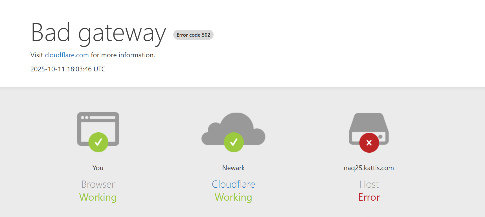
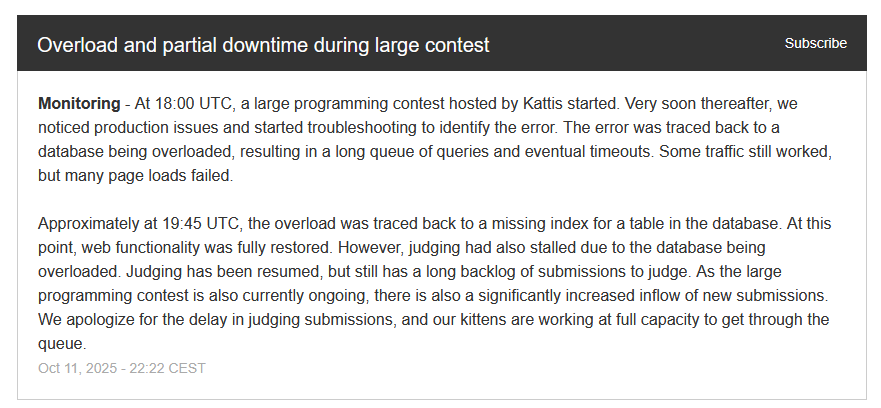
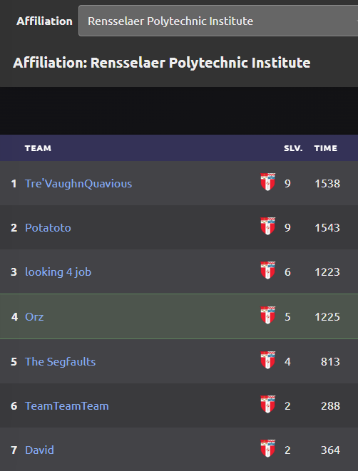

So, we attempt ICPC again for the second time. If you want to read about my 2024 experience, check  [this]() out.

This time, I am better and worse in certain aspects. Better in that I am now more experienced with having done ICPC last year, and I have significantly more problems under my belt this time around. But worse in that I haven't touched much technical coding problems since snagging my intern offer at Google.  

But we go again.

## My Team

This time we are entering qualifiers with a full team of 3. I'm teaming up with the same original 2nd member from last time and a new roommate.

## Qualifiers - 10/11/2025

It's the day of the qualifiers, and we were grouped up in our living room with our laptops open, our notebooks nearby, and watching the time tick down 5... 4... 3... 2... 1...

We reload the page to face our problems and ...

<figure>
    
</figure>

Classic ICPC moment. 

We ran into server overload last year as well but this time it was worse. 

Everyone was blocked and waiting around for a whole 1 hour before we were able to access the problems on Kattis, and it turned out to be a database indexing error on Kattis's side. SMH.

<figure>
    
    <figcaption>They should have taken a database systems class</figcaption>
</figure>

However, we were able to work off of a pdf of the problems sent to us by the organizers after 35 minutes of waiting and there we dug in. 

The problems were a bit harder than last time but we presevered. 

Our team was able to solve 5 problems, me personally solving 2 (A, E).

Overall, we didn't do too bad for a bunch of rusty cs seniors as we ended up placing 4th in our university standings. 

<figure>
    
</figure>

I also think it's worth nothing an interesting lesson I took away from the qualifiers this time.

Last year it was just my 2nd teammate and I, so we had very little verbal talking throughout as we could just tackle any question we found fit to solve and that was it.

This time however, after silently getting a migraine from thinking about a problem, I decided to just talk about it aloud and ask for some contributions from my team. We only had an hour left anyways so might as well break a few concentrations for a possibility of getting some progress on this problem.

And I found it was actually a lot more productive and beneficial to talk about certain problems and our troubles with them, because I noticed it got the brain juices flowing a lot more and just explaining a problem out loud actually helped me solve the problem. 

An anecdote in teamwork and collaboration there. Anyways. 

## Regionals - 11/09/2025

2 days later we got an email saying we qualified for the regionals, and now we prepare for our last stand. I will come back and update this the day after with hopefully better standings than last year.

In the meantime, check out my first ICPC experience in my previous blog!