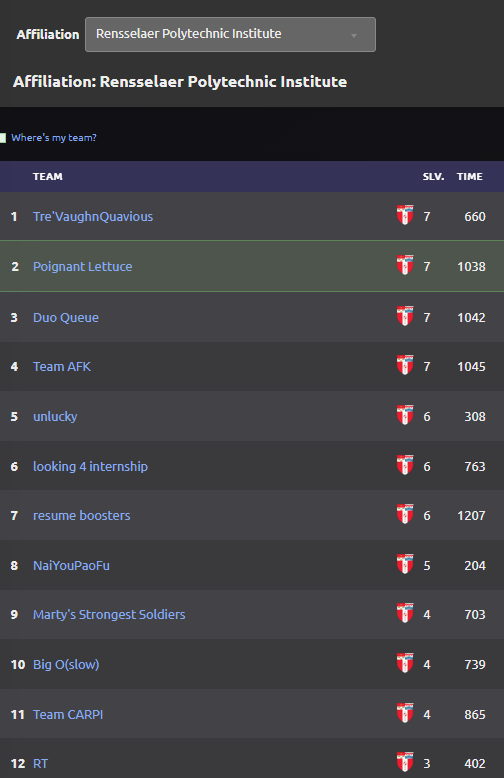
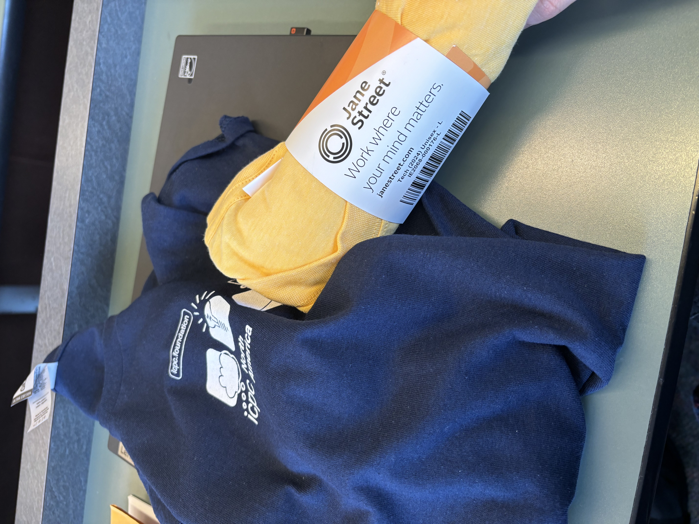
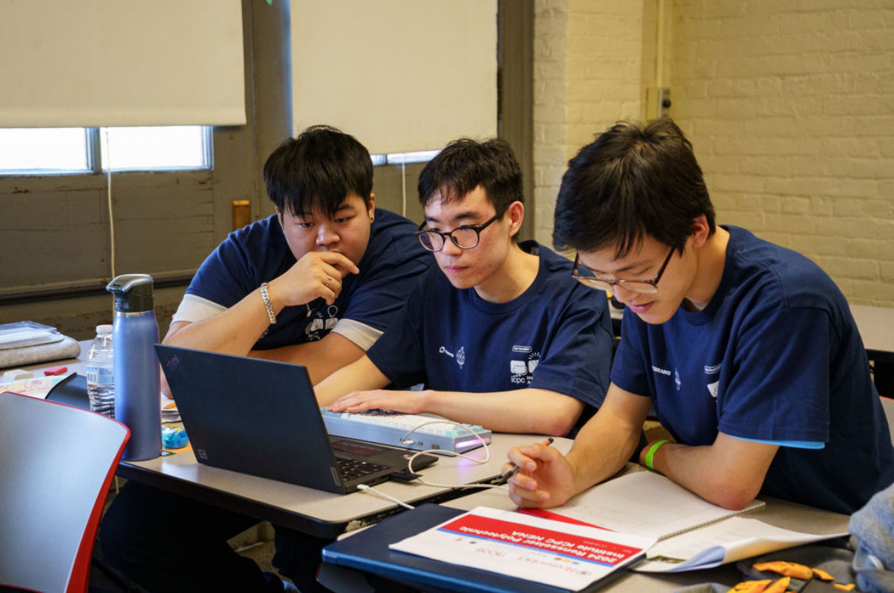
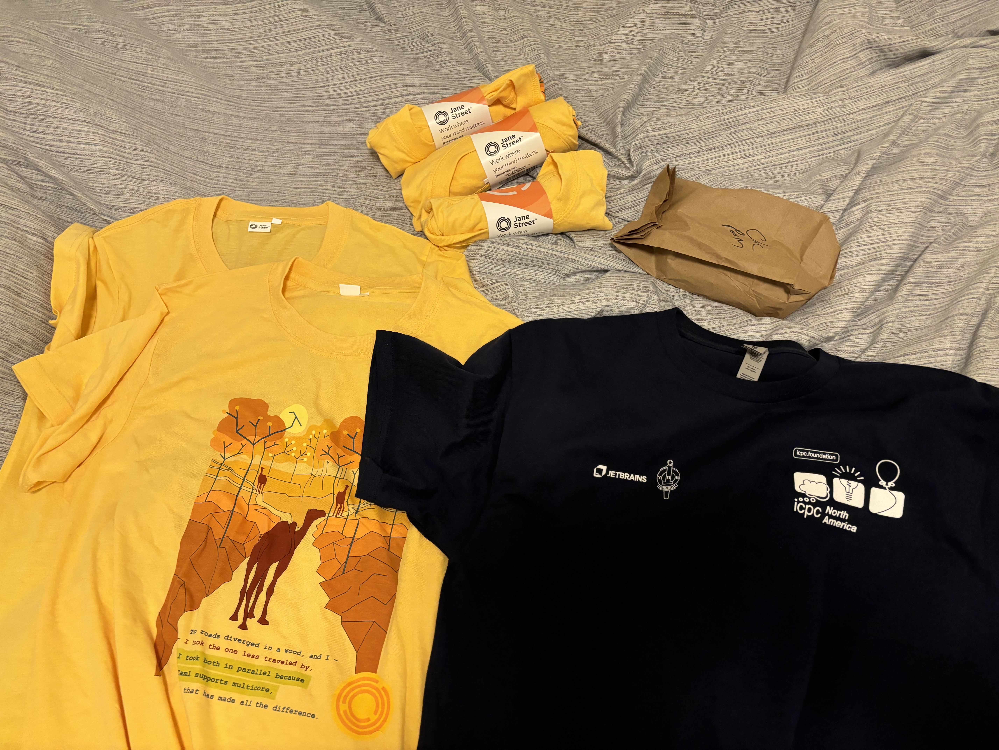

I’m by no means a great competitive programmer, but I’m good at algorithms and data structures and hey, I had over 500 Leetcode problems and a contest rating of 1800, so I thought’d I’d give ICPC a try for fun (and the free food + merch). So here was my experience competing in the prestigious 2024 ICPC during my Junior fall semester!

## My Team

Choosing my team was a dilemmna for me as I didn't know much people into competitive programming or willing to do the ICPC. At first, I was just going to register solo as I just wanted the experience, but after asking around one of my roommates had a friend with previous competitive programming experience who was also looking for a team to join. So, I met my first teammate who actually was immensely helpful in solving the harder problems I couldn't crack. He did competitive programming since high school, had a peak Leetcode contest rating of ~2000 and had some Codeforces under his belt as well. So I was very excited to team up with him.

We decided to name our team "Poignant Lettuce". Do not ask me why, ask my teammate. 

## Qualifiers - 10/05/2024

The first step is the ICPC qualifiers. The qualifiers is a 5 hour unproctored online event that allows each university to be able to select which teams will advance to the regionals to represent them. So it's important to score well here relative to the other teams in your university if you wish to move on to the regionals. 

Going in, I definitely had low expectations. It was my first time doing ICPC and I knew how prestigious this competition was, so I assumed the qualifers must be filled with some tough questions as well. I expected some real ICPC level questions so I had the mindset of I'll be happy if I could even solve one. 

Well, turned out to be way easier than I expected. Some of these questions were really easy, Leetcode easy level questions. As I started tackling and passing these questions I started to gain more confidence. I remember being so happy seeing my first submission pass all test cases that I started to feel the thrill and adrenaline of taking on each question after the next. 

In the end, I was able to solve 4 questions and my teammate 3 (while I was zooming past the easies-mediums he tackled the harder ones), totaling 7/12 and placing us 2nd place in our university's standings. I was really happy with my results, not just because this was basically a guaranteed qualifaction to the regionals, but also because of how I immensely exceeded my own expecations. 

<figure>
    
    <figcaption>Poignant Lettuce for da win</figcaption>
</figure>

## Northeastern Regionals - 11/10/2024

We qualified for the regionals! 

The regionals is another selection process to pick the top teams from each region (mine was North America East). So now, instead of competing against teams in my own university, we compete against all other university teams in our region. It's a 5 hour proctored in-person event with multiple university teams in the same building. This is now a step closer to the taste of the true ICPC experience. 

I was definitely very excited. We picked up a 3rd teammate (a roommate of mine) and we put in some study sessions together to practice. I was no longer just doing leetcodes but practicing some codeforces as well. 

On the day of the event, my university was a hosting spot for the regionals so I didn't need to travel very far to get to the event as it was just in one of our campus buildings. The regionals was from 11am to 4pm with free breakfast and lunch and sponsorship t-shirts. 

Here's some photos:

<figure>
    
    <figcaption>Initial merch that's handed out</figcaption>
</figure>

<figure>
    
    <figcaption>Solving some problems with me in the middle :D</figcaption>
</figure>

I wish we did better haha, but we ran into technical difficulties for the first whole hour as we didn't set up the ICPC specific OS before the event and had trouble connecting to the wifi. So that was a whole hour wasted trying to get the wifi working. It didn't stop us from attempting the questions though as they give you a physical paper copy of the problems. But it stopped us from submitting them, which helps a lot in gathering feedback on our approaches. And obviously also our submission times were slower than others. And the keyboard we brought was configured to a Mac 🤦 so it was bugging out on our Windows laptops, so that was not fun. 

Lots of misfortune due to external problems, but we were able to solve 3 problems and place 55/97 in the region. I had a lot of fun competing in a team event, meeting other teams from other universities, and solving problems at an ICPC level so it was still a great time.

## Takeaways

Gained a lot of confidence and experience in teamwork, competing, and solving hard algorithmic problems.

Also, took a good amount of free food and merch.

<figure>
    
    <figcaption>5 Jane Street t-shirts, 1 ICPC t-shirt, and an extra sandwich</figcaption>
</figure>