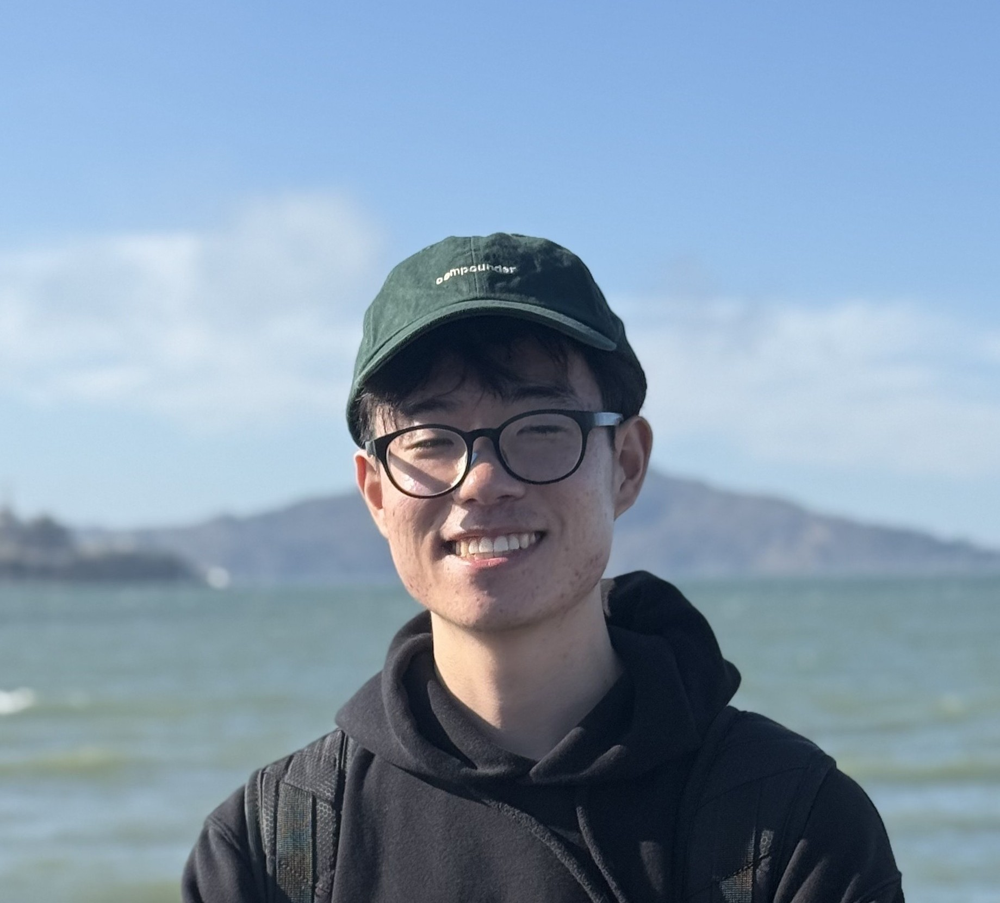

    

Hi, I'm Philip Park. I'm a senior studying computer science at Rensselaer Polytechnic Institute. 

What I really enjoy and focus more on (sometimes to my own detriment. such as blindness to other more "practical" skills) is building my brain. I love the feeling of thinking, and grinding away at something. This manifests in learning new things, tackling hard puzzles and problems, and designing and implementing full end-to-end features on the job. 

## Industry

Previous swe intern at Google where I worked in the backend of a voice and messaging infrastructure team. I improved system scalability and impacted over 20 Alphabet teams by developing a C++ distributed messaging queue to manage scheduled data changes, collaborated with cross-team stakeholders to develop a dashboard to improve UX and accessibility for operational teams, and owned a feature from start to end including designing, documenting, developing, testing, implementing a rollout strategy, and finally seeing it run in production. 

Previous swe intern at a SAAS startup, where I immediately made lasting impact my first month by developing a tool to automate a weeks-long manual process to seconds. I also was very proactive in this startup and asked for more technical work. This led to me doing full-time swe technical interviews in the middle of my internship to join a separate team working on client-facing tools. I passed the interviews and during the last month of my internship, I spent it working alongside remote full-time swes on a full-stack project where I developed a web page to track document downloads for compliance and security.

Open source developer and a frequent contributor to RCOS (Rensselaer Center for Open Source), my university's open source community.

## University

I try to give back to the CS community at my university. 

I was a computer science tutor for 2 courses at the same time (Computer Science 1 and Data Structures (a notoriously difficult class for freshmen))

I'm part of Upsilon Pi Epsilon, a CS honors society, where I wrote algorithmic problems for a competitive programming contest and conducted resume reviews and mock technical interviews.

I also was a 2024 ICPC contestant. I placed 2nd in my university during the ICPC qualifiers, which allowed me to qualify and compete in the ICPC regionals.

I'm also the president of RPI's Chess Club, a Chess.com College Ambassador, and the founder of RPI's first official Chess.com.

## Personal Life

Competitive chess player. I like to compete in online and over the board tournaments, had a peak rating of 1850 which makes me top 2-3% globally, and during my time at Google I placed 3rd in a Google chess tournament. 

Artist (I'm actually pretty good at drawing. little known by others.), music producer (well, atleast I was for some time), and language learner (Korean, Spanish). 

I love to self-study. Currently, I'm reading System Design Interview by Alex Xu, Crafting Interpreters by Robert Nystrom, and Operating Systems in Three Easy Pieces.

I'm nowhere close to where I wish to be. So watch me progress through here:
* [Leetcode](https://leetcode.com/u/philippark271/)
* [Codeforces](https://codeforces.com/profile/philipdpark)
* [Kaggle](https://www.kaggle.com/philipdpark)
* [Self-Study](learning.html)
* [Chess](https://www.chess.com/member/syntax_sugar)
* [Art]()
* [Soundcloud](https://soundcloud.com/philip-park-135739657)

And of course, if you are a recruiter or just someone who is curious:

[Download my resume (PDF)](../assets/Philip_Park_Resume.pdf)