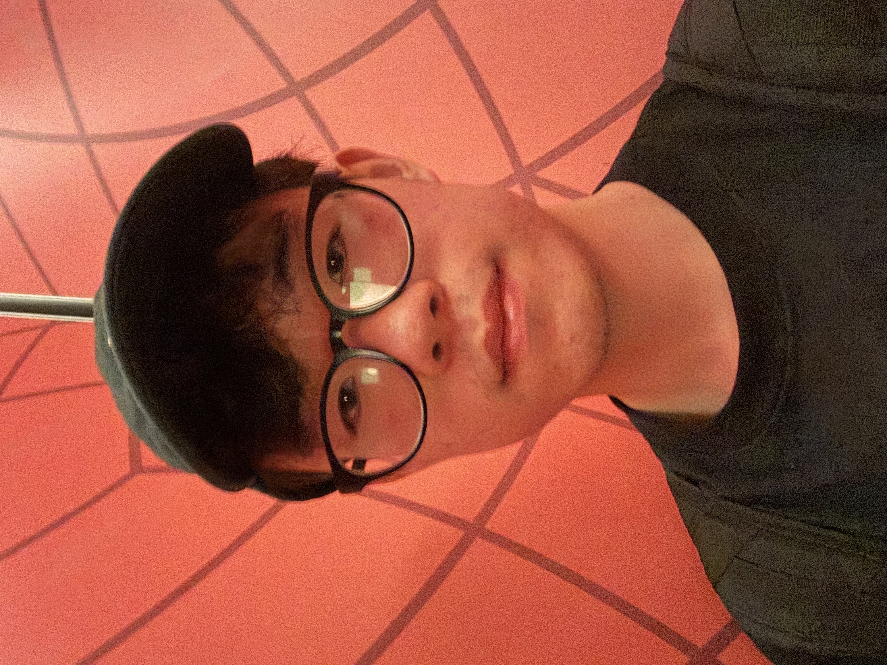

<!--

    

-->

Hi, I'm Philip Park. I'm a senior studying computer science at Rensselaer Polytechnic Institute. I'm still trying to figure out what I'm interested in (in terms of my career and computer science), but some things that I've enjoyed so far are backend, infrastructure, and machine learning. 

What I really just enjoy and focus more on (sometimes to my own detriment. such as blindness to other more "practical" skills) is just building my brain. I love the feeling of thinking, and grinding away at something. This manifests in learning new things, tackling hard puzzles and problems, and implementing an end-to-end feature on the job. 

Learning new things:
* Languages: Korean, Spanish.
* Chess: Went from a complete noob of a rating of 300 to advanced with a rating of 1850.
* Algorithms: Data-structures I was fine with, and actually excelled in my DS course. But algorithms I struggled with. But thanks to technical interviews and the internship hunt, I was able to get pretty good at this, as shown through my [leetcode profile](https://leetcode.com/u/philippark271/). And I was able to compete in the 2024 ICPC, where I placed 2nd in my university during the qualifiers and qualified to compete in the regionals.
* Music Production: Dabbled a bit in this. Got to a point where I could listen back to my old work and be surprised. If you want a listen, here's my [soundcloud]().
* Art: Was always an artist since I was a child. Was known as the quiet, shy, artist kid growing up. But I really wasn't that good until a couple of years ago when I decided to really pursue this and read through [a book]() and unlocked a new level of ability. Here's my [art website of some-sort]()

One thing that I regret heavily is dropping a lot of my interests in pursuit of single goals. I didn't realize you could do multiple un-related things, and still succeed in your main career. In the pursuit of my career, landing a good internship, and building my technical skills, I stored away my other interests and skills. This was a mistake, and I'm trying again to pick these things back up. In the meanwhile, you could watch me grow in real time through these websites I provided!

I really am in the pursuit of greatness. I love seeing virtual numbers go up. So watch me progress through here:
* [Leetcode](https://leetcode.com/u/philippark271/)
* [Codeforces](https://codeforces.com/profile/philipdpark)
* [Kaggle](https://www.kaggle.com/philipdpark)
* [Chess](https://www.chess.com/member/syntax_sugar)
* [Art]()
* [Soundcloud](https://soundcloud.com/philip-park-135739657)

This is less of a "look at me, I'm cracked and know everything", and more so a "look at me, I'm not cracked, nor know anything, but I will be and you can watch me" type of blog.

And I like putting all this out there to the public internet space because ... well, for starters, I was inspired by someelse who did it. But also, putting it out there keeps me motivated, makes progress more visible, and introduces more fun and playfulness to my life and more opportunities to build around this blog. For example, building this website itself and writing articles is extremely fun and wouldn't have happened if I didn't decide to create this.

One other thing I should be cautious of me doing. It's holding myself back. From joy. Even if it's not technical, not related to my career, etc etc. If it's fun and I enjoy it, I should do it whole heartedly. Because the same source that gives me joy in doing things will be the same source that gives me joy in pursuing my career as well. I can't have abundance in one area of my soul and starvation in another. There needs to be abundance throughout my soul in general. Or else, the starved, void section will eat up my insides and take away the little abundance I do have. Because that's how the soul works. It needs to pursue what it wants to pursue, or it will have trouble pursuing anything at all. 

One other philosopy I hold dear, is the concept of if you can get good at one thing, you can good at anything. So, what that means is as a child still exploring their future. I would get great at the one thing that you enjoy right now, regardless of if it's economical. Because the process of getting really good at one thing is the same as getting really good at another. So I'm more tailored towards the mentality of getting really good than the thing that I'm getting really good at.

Which is also dangerous and risky, because capitalism.
There's a funny [WKYK skit]() that points at this paradox of capitalism and goodness. I think capitalism is wonky. 

### Experience

* Swe Intern @ Google
* Swe Intern @ GPES (SAAS startup)
* CS tutor @ RPI

### Projects

I'm interested in building micro-tools, programming languages (working my way through crafting interpreters in the hopes of one day publishing my own esolang), and static code analysis tools (? still in the process of figuring out what this is about)